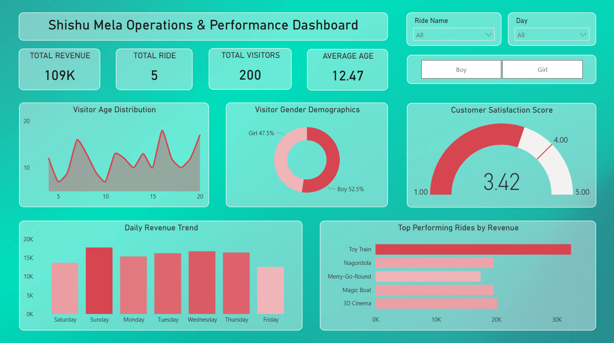
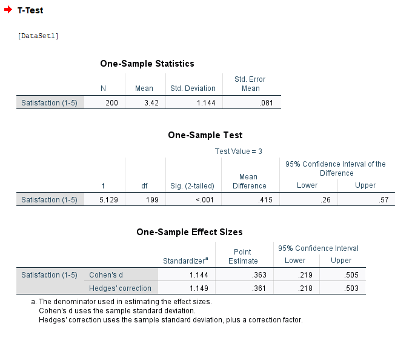
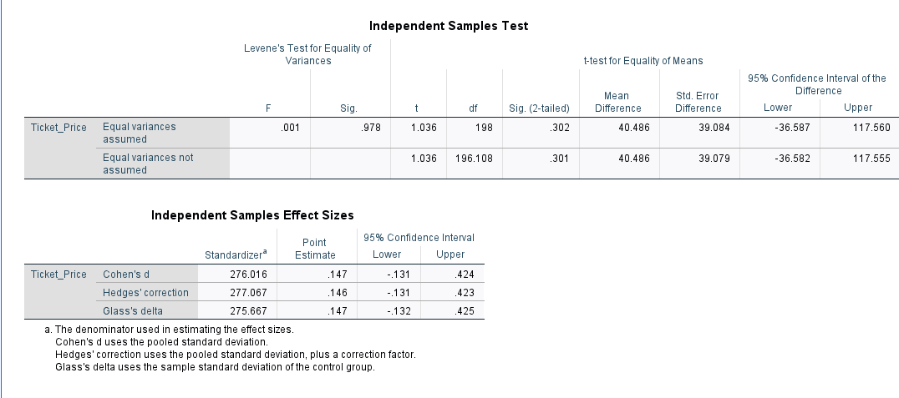
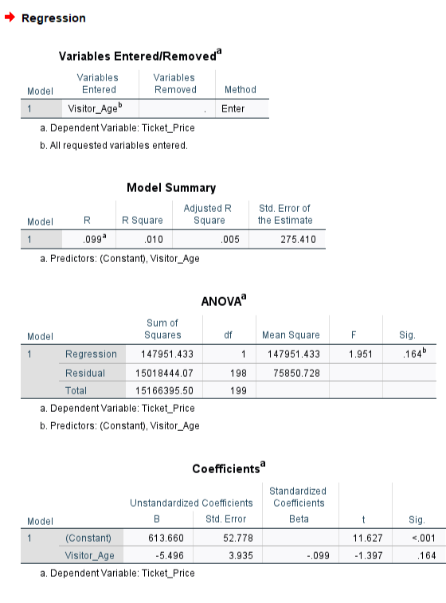
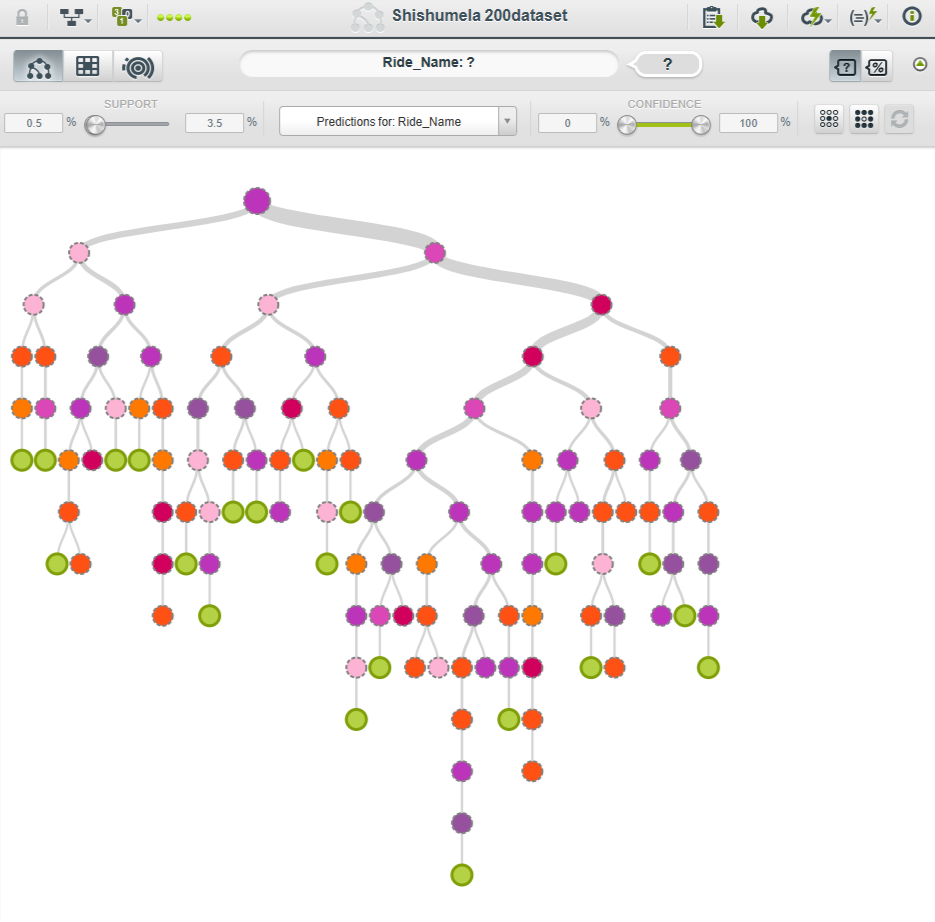

# 🎡 Shishu Mela Operations & Performance Analysis

## 📌 Project Overview
This project analyzes operational data from **Shishu Mela**, a theme park, to understand visitor behavior, spending patterns, and satisfaction levels. Using a simulated dataset of **200 visitors**, I developed an interactive **Power BI Dashboard**, performed statistical hypothesis testing using **SPSS**, and built a predictive model using **BigML**.

## 🛠 Tools & Technologies
* **Data Visualization:** Microsoft Power BI (Dashboard & DAX)
* **Statistical Analysis:** IBM SPSS Statistics
* **Machine Learning:** BigML (Decision Tree)
* **Data Cleaning:** Microsoft Excel

## 📂 Dataset Description
The dataset contains **200 records** with the following key attributes:
* `Visitor_Age`: Age of the customer.
* `Gender`: Male/Female.
* `Ticket_Price`: Amount spent on tickets.
* `Ride_Name`: The specific ride chosen by the visitor.
* `Satisfaction_Score`: Rated on a scale of 1 to 5.

---

## 📈 Interactive Dashboard (Power BI)

I designed a dynamic Power BI dashboard to visualize the park's daily operations and KPIs.

### 🔑 Key Features:
* **Revenue Tracking:** Visualized total ticket sales and revenue trends.
* **Ride Popularity:** Analyzed which rides are most preferred by different age groups using bar charts.
* **Customer Demographics:** Breakdown of visitors by Gender and Age.
* **KPIs:** Calculated Average Satisfaction Score and Total Footfall using DAX measures.

---

## 📊 Statistical Analysis (SPSS)

I conducted three specific statistical tests to validate business hypotheses:

### 1. One-Sample T-Test (Customer Satisfaction)
* **Objective:** To determine if the average customer satisfaction is significantly different from Neutral (Score: 3).
* **Hypothesis:** $H_0: \mu = 3$ vs $H_1: \mu \neq 3$
* **Result:** With a mean score of **3.42** and a significance value of **<.001**, we rejected the Null Hypothesis.
* **Insight:** Visitors are **significantly satisfied** with the park's services.

### 2. Independent Samples T-Test (Spending Behavior)
* **Objective:** To analyze if there is a significant difference in spending between Boys and Girls.
* **Result:** The significance value (p-value) was **.302** (> 0.05).
* **Insight:** There is **no significant difference** in spending behavior based on gender. Both groups spend roughly the same amount.

### 3. Linear Regression (Age vs. Spending)
* **Objective:** To predict Ticket Price based on Visitor Age.
* **Result:** The analysis showed a weak linear relationship (R-Square near 0.01, Sig .164).
* **Insight:** Age is not a strong predictor of spending in this specific dataset; visitors of all ages choose a mix of expensive and affordable rides.

---

## 🌳 Machine Learning Model (BigML)

To predict visitor preferences, I constructed a **Decision Tree** model using BigML.

* **Target Variable:** `Ride_Name`
* **Outcome:** The model generated rules to predict which ride a visitor is likely to choose based on their age group (e.g., Children <10 prefer 'Toy Train', Teenagers prefer '3D Cinema').

---

## 🚀 Key Business Insights
1.  **High Satisfaction:** The management is doing well in maintaining customer happiness (Score > 3).
2.  **Universal Pricing:** Since gender doesn't affect spending, marketing campaigns can be gender-neutral.
3.  **Targeted Operations:** The Decision Tree reveals distinct preferences by age, allowing for better queue management.

---

## 👨‍💻 Author
**[Jahid Hasan]**
* **LinkedIn:** https://www.linkedin.com/in/jahidstm/
* **Email:** jahidhasanstm@gmail.com

Feel free to star ⭐ this repository if you find the analysis useful!
